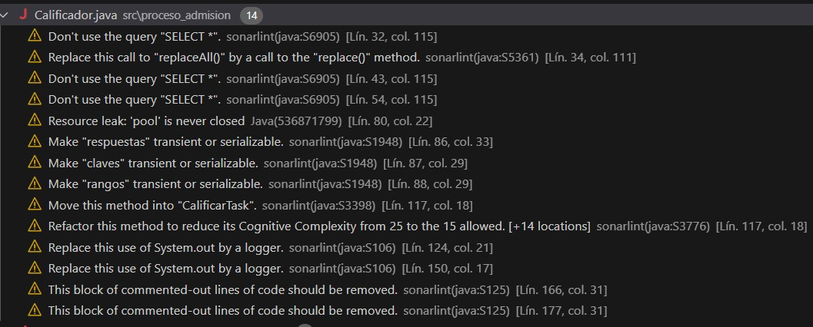

# Proyecto de Admisión - Reporte de SonarLint
### Alumno: Keler Modesto Calixto
 Código: 18200114
 Curso: Verificación y validación de software. 2024-2
## Reporte de problemas
### Archivo: Calificador.java

En este archivo se detectaron 14 problemas, aquí la captura de SonarLint:


## 1. Identificación del 1er problema
### Don't use the query "SELECT *" (Lin. 32 col. 115); (Lín. 43, col. 115); (Lín. 80, col. 115)
- **Categoría**: Code Smell
- **Severidad**: Critical
### Muestra del código problemático
- **Antes**:
   ```java
   String query = "SELECT * FROM respuesta";
   String query = "SELECT * FROM clave";
   String query = "SELECT * FROM rango";
## Descripción del problema
- **Violación**: SonarLint detectó que el uso de `SELECT *` en una consulta SQL es un *code smell*, ya que puede afectar el **rendimiento**, **sostenibilidad** y la claridad del código. Se recomienda especificar las columnas necesarias en lugar de utilizar `SELECT *`.

## Explicación de la refactorización 
- **Corrección**: Se especificaron las columnas necesarias en lugar de utilizar `SELECT *`. Esto mejora el rendimiento y la claridad del código.
## Código corregido 
- **Después:**
  ```java
    String query = "SELECT ide_iIndice, res_vcRespuesta FROM respuesta";
    String query = "SELECT cla_iIndice, cla_iPosicion, cla_vcRespuesta FROM clave";
    Stirng query = "SELECT ran_iIndiceMinimo, ran_iIndiceMaximo, cla_iPosicion FROM rango";
Con esto se redujeron 3 problemas con el SELECT*
## 2. Identificación del 2do problema
### 3. Make "respuestas", "clave" and "Rango" transient or serializable.
- **Categoría**: Code Smell
- **Severidad**: Major
## Muestra del código problemático
- **Antes**:
  ```java
  private List<Respuesta> respuestas;
  private List<Clave> claves;
  private List<Rango> rangos;
## Descripción del problema
- **Violación**: SonarLint detectó que el campo `Respuesta` deb ser marcado como `transient`o la clase `Respuesta`debe implementar `Serializable`para asegurar la correca serialización de la clase `Calificador`
## Explicación de la refactorización
- **Correción:** Se decidió hacer que el campo `respuesta`sea `transient`para evitar problema e serialización.
## Código corregido
- **Después:**
  ```java
  private transient List<Respuesta> respuestas;
  private transient List<Clave> claves;
  private transient List<Rango> rangos;
Se corrigió las demás clases. SonarLint indica que la variables que se mosotró deberían ser "transient or serializable" se debe a que se utiliza las clases como parte de un proceso que involucra concurrencia o serialización, y Java necesita asegurarse de que los objetos puedan ser serializados correctamente en esos contextos.